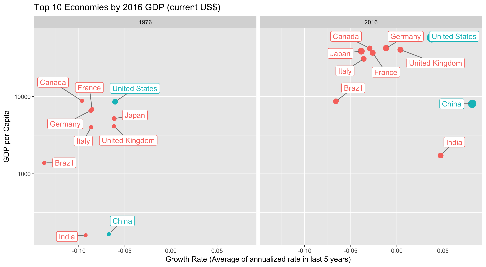

# Some Data Visualizations I made
## Evalyn Li

# 1 

 institutions")

# 2 

*Both the United States and China have large GDPs, but the US has greater GDP per capita and China’s GDP growth rate increased more dramatically from years 1976 to 2016.*

The graph shows the top 10 world economies based on 2016 GDP, in current USD. 
The size of the circles represent the relative size of GDP, the x location is the annual growth rate, averaged based on the listed year’s previous 5 years and the y location is the GDP per capita. The y is a log scale to show the dramatic increase from 1976 to 2016.

The data comes from the WDI package in R.
The indicator NY.GDP.MKTP.CD provides GDP (current US$) and the indicator NY.GDP.PCAP.CD provides GDP per Capita (current US$).